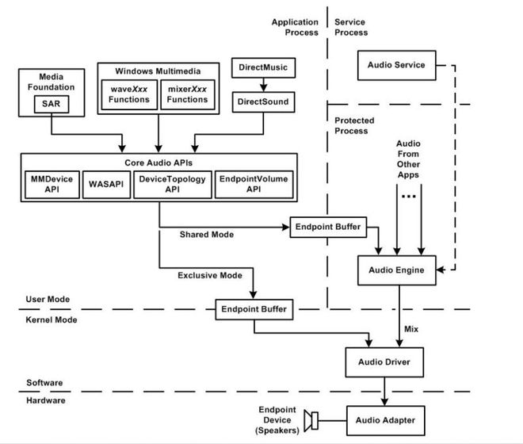

# windows audio core

* 模式
    * 共享模式
    * 独占模式

* MMDevice API
    * 是最基本的 Core Audio API, 服务于其他3个API. 
    * 枚举出所有可使用的音频设备属性, 确定其功能, 并为这些设备创建驱动程序实例. 

* WASAPI
    * 管理应用程序和音频终端设备之间音频数据的流. 

* DeviceTopology API
    * 客户端可以遍历音频适配器设备和音频终端设备的内部拓扑, 并单步执行将设备链接到另一台设备的连接. 通过 DeviceTopology API 中的接口和方法, 客户端程序可直接沿着音频适配器 (audio adapters) 的硬件设备里的数据通道进入布局特征(例如, 沿着音频终端设备的数据路径上进行音量控制). 

* EndpointVolume API
    * 客户端可以控制和监视音频终端设备的音量级别. 