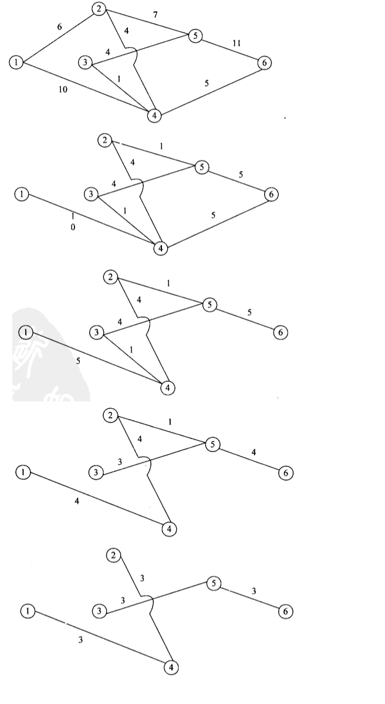

# 绪论
* 系统的特性
    * 整体性
    * 层次性
    * 目的性
    * 稳定性
    * 突变性
    * 自组织性
    * 相似性
    * 相关性
    * 环境适应性
* 系统理论
    * 整体性原理
    * 整体突变原理
    * 层次性原理
    * 开放性原理
    * 目的性原理
    * 系统环境互塑共生原理
    * 秩序原理
    * 生命周期原理(演化原理)
* 系统工程方法论
    * 霍尔三维结构(硬系统方法论)

        

    * 软系统方法论(切克兰德提出)
        * 解决社会问题和软科学问题
        * `可行`, `满意`替代`最优`
        * 5个步骤
            * 问题现状说明
            * 理清问题的关联因素
            * 建立概念模型
            * 比较
            * 实施
* 信息系统工程
    * 生命周期
        * 系统规划
        * 系统分析
        * 系统设计
        * 系统实现
        * 系统运行与评价
    * 信息系统建设的原则
        * 高层管理人员介入原则
        * 用户参与开发原则
        * 自顶向下规划原则: 主要目标是达到信息的一致性
        * 工程化原则: 为了提高软件的可维护性. 

# 经济管理与应用数学
* 会计
    * 记录, 分类, 汇总, 计量, 报告. 
    * 会计计价: 确定一项资产的价值. 
        * 历史成本计价
        * 公允价值计价
    * 会计报表
        * 资产负债表

            

        * 利润表
            
            
        
        * 利润分配表
            
            
* 企业结构
    * U型: 实行集中控制和统一指挥. 
    * M型: 战略决策和经营决策分离. 
    * 矩阵制结构(二维结构, 项目型结构): 
        * 既有按职能划分的垂直领导系统, 又有按产品划分的横向领导关系. 
        * 使小组成员接受小组和职能部门的双重领导. 
    * H型: 多个法人实体集合的母子体制. 
    * 模拟分权机构: 介于U型和M型之间
    * 团队型结构: 
    * 网络型结构: 

* 概率统计应用
* 图论应用
    * 最小生成树
        * 要点
            * 包含图中所有节点
            * 树的所有边的权值总和最小
        * 算法
            * Prim算法: 从一个点出发, 每次向点集加入新点. 

                

            * Kruskal算法: 按权值从小到大选边加入边集. 

                
    * 最短路径
        * 带权图的最短路径问题即求两个顶点间长度最短的路径. 
        * 单源最短路径. 
            * Dijkstra算法
                * 按长度递增次序产生最短路径. 
                * 红点集: 最短距离已确定的顶点集; 蓝点集: 最短距离未确定的顶点集. 
                * 在当前蓝点集中选择一个最短距离最小的蓝点来扩充红点集, 以保证算法按路径长度递增的次序产生各顶. 

                

            * Floyd算法
        * 网络与流量问题: 求一个点到另一个点的最大运送流量. 
            * 要求
                * 每条边上的流量不能超过该边的容量
                * 中间节点的流量为0(进出相等)
            * 解题: 每找出一条路径算出流量, 将路径上各边的流量减去算过的流量. 剩余流量为0的边应该移除. 
                
                

                

                * 最后算出总流量为: 10 + 6 + 5 + 1 + 1 = 23
            
        * 排列组合
            * 排列: $P_n^r$或者P(n, r), 表示从n元集中取r个元素的排列数. 
                * 例: 使用ABCDE进行编码. 
                    * D和E不能出现在首尾, 则共有几种编码方法? 
                        > $P_3^2 \times P_3^2 = 36 $
                    * A不能在首, B不能在尾, 则共有几种编码方法? 
                        > P(总) - P(A在首) - P(B在尾) + P(A在首且B在尾) \
                        > $P_5^5 - P_4^4 - P_4^4 + P_3^3 = 78 $
            * 组合: $C_n^r$或者C(n, r), 表示从n元集S中取r个元素, 称为S的一个r组合
        * 排序
            * 堆排序(大根堆)
                * 构造堆: 
                    * 第0个为根节点, 第1, 2个为其左右子节点. 以此类推. 
                    * 从最下层节点开始: 左右子节点中较大者, 与父节点对比, 若大之, 则与父节点互换. 如此直到根节点. 这样, 所有节点都比它的子节点大. 
                    * 时间复杂度: $nlog(n)$
                        * 假设为完全树. 树的高度: $m = log_2(n+1)$
                        * 第2层比较$2^0$次, 第三层比较$2^1$次, 第m层比较$2^{m-2}$次
                        * $2^0 + ... + 2^{m-2} => 2^{m-1} - 1 => \frac{n+1}{2} - 1$
                * 排序: 
                    * 根节点与末尾节点互换, 则末尾节点为最大值. 
                    * 排除末尾节点, 调整根节点以重建大根堆. 方法是将根节点与左右子节点的较大者比较, 若根节点小, 则下沉. 重复此操作, 直到满足大根堆的要求. 
                    * 时间复杂度: 最坏情况下, 调整一个新的根节点的位置, 需要的操作次数为树的高度: $\lfloor log(n) \rfloor$ , 越往上层, 次数越少. 最后得时间复杂度为$O(nlog(n))$
        * 数值算法
            * 误差分析
            * 穷举搜索法
            * 迭代法
            * 递推法
            * 递归法
            * 分治法
            * 回溯法(试探法)
            * 贪心法
            * 动态规划法

