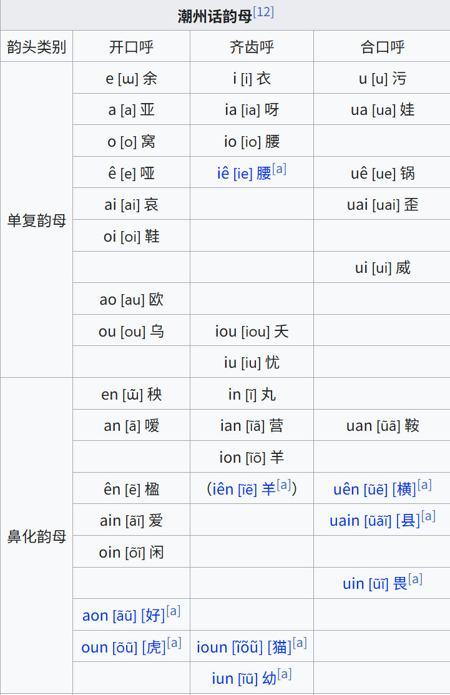
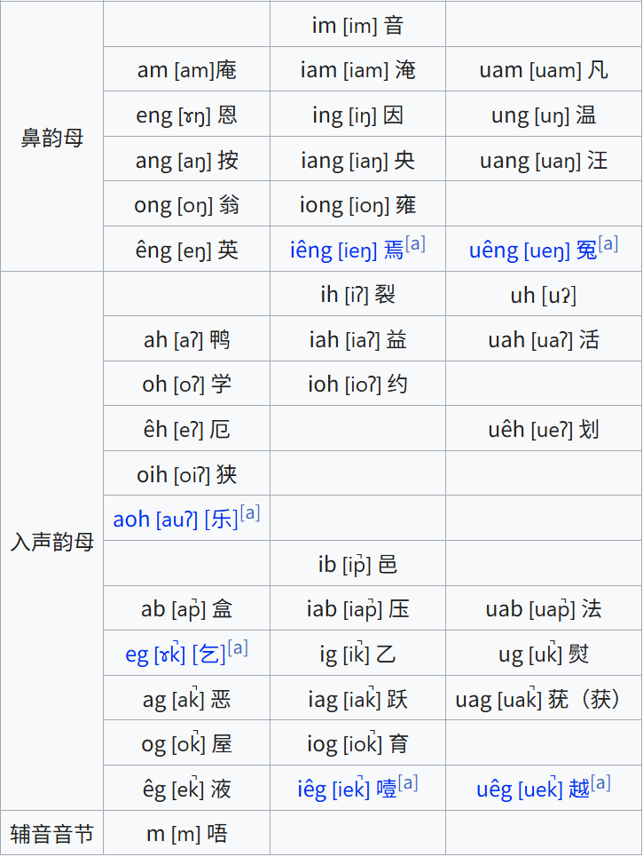

* 参考
    * [潮语拼音教程](https://kahaani.github.io/gatian/index.html)
* 字典词典
    * https://github.com/hokkien-writing/rime-teochew
# 发音
* 八声调
    * 阴平(平, 长): 诗 (普通话一声)
    * 阴上(高往低): 死 (普通话四声)
    * 阴去(往低, 再往高上升少许): 世 (普通话三声)
    * 阴入(低且短): 薛
    * 阳平(高且平): 时
    * 阳上(低往高): 是 (普通话二声)
    * 阳去(低且平): 示
    * 阳入(高且短): 蚀

* 声母
    
    * 注
        * 没有普通话的f音(相应的多为b或p或h, 如, 方, 飞)
        * ng可为声母或韵母
        * 没有翘舌音
        * 没有普通话j(-> g或z), q(-> k或c), x(-> h或s)

* 韵母
    
    
    * 注
        * 总90个, 常用69个, 出去入声韵母和鼻化韵母后剩34个, 再出去和普通话相同或相近的韵母后剩16个. 

# 字词
* 生僻字词
    * 代
        * 人称
            * 阮uang2: 我们
            * 俺nang2: 咱们
            * 恁ning2: 你们
            * 伊侬i-nâng: 他们
        * 所有格
            * 我其 uá-kāi: 我的
    * 名
        * 𡟓ai5: 母亲
        * 尫u1: 脚头尫, 膝盖
        * 㜁za1母bhou2: 女人
    * 动
        * 𢺞ba3: 往头上打
        * 𡥘cua7: 娶; 带(人)
        * 𢭪kioh8: 拿
        * 蹃nêg4: 蹬
        * 踢têg4跎to5:  
        * -食物
            * 𫃇cib8: 和(面)
    * 形
        * 荋re5: 乱
        * 𤰉la6
    * 副
        * 𠀾bhoi6: 𠁞
